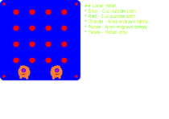

# Switch board cover

Cover for the switch board. Intended to be laser cut/engraved on thin plastic of plywood.

## Third party images used

* [One-eyed monster](https://publicdomainvectors.org/en/free-clipart/One-eyed-monster/37593.html) (Licence: Public domain)

## Licence

Copyright © 2023 Phil Baldwin

This work is licensed under a Creative Commons Attribution-ShareAlike 4.0 International License.

You should have received a copy of the license along with this work. If not, see <http://creativecommons.org/licenses/by-sa/4.0/>.
